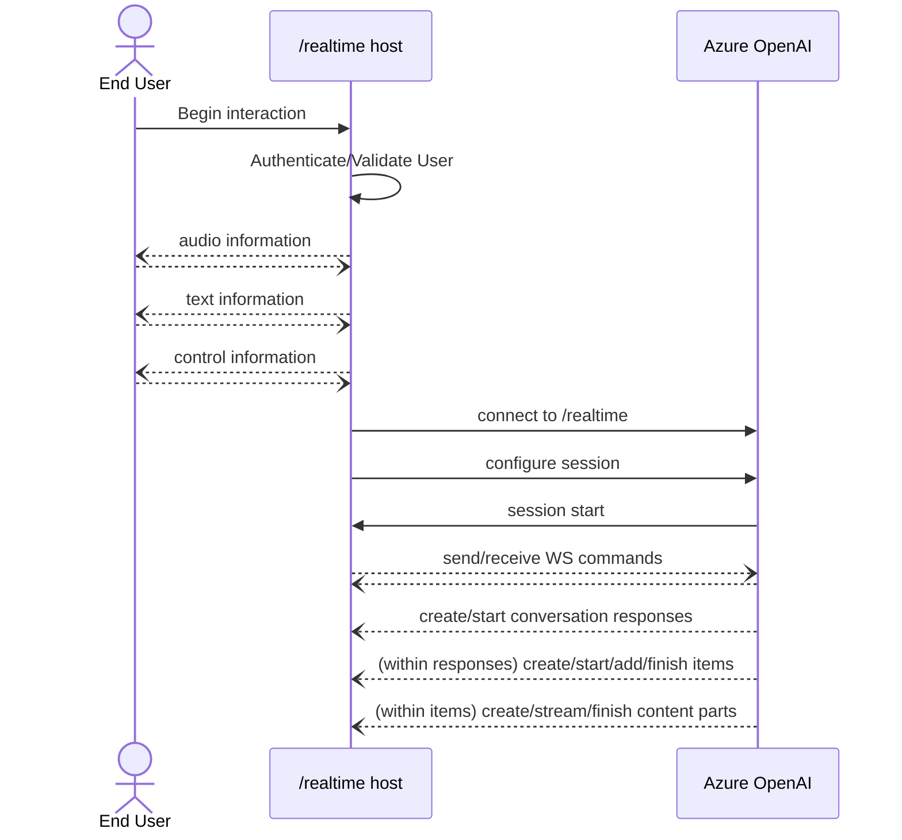

# Azure OpenAI GPT-4o Audio およびリアルタイム: パブリックプレビュー ドキュメント
Azure OpenAIの /realtime 機能および gpt-4o-realtime-preview のパブリックプレビューへようこそ！このリポジトリには、/realtime の使用に関するドキュメント、スタンドアロンのライブラリ、およびサンプルコードが含まれており、Azure OpenAIと標準のOpenAI v1エンドポイントの両方に適用可能です。

## 概要: /realtime とは何ですか？

このプレビューでは、gpt-4o-realtime-preview モデルファミリー向けに新しい /realtime APIエンドポイントを導入しています。 /realtime は以下の特徴を持っています:

- 低遅延の「音声入力、音声出力」による会話のやり取りをサポートします
- テキストメッセージ、関数ツールの呼び出し、そして /chat/completions など他のエンドポイントからの多くの既存機能と連携します
- サポートエージェント、アシスタント、翻訳者、またはユーザーとの高度に応答的なやり取りが必要な他のユースケースに最適です

/realtime は、エンドユーザーとモデル間の完全な非同期ストリーミング通信を容易にするために、WebSockets API を基盤に構築されています。これは、エンドユーザーとの接続とモデルエンドポイントの接続の両方を管理する、信頼できる中間サービスのコンテキストで使用されることを目的としています。信頼できないエンドユーザーのデバイスから直接使用するために設計されているわけでは なく、音声データのキャプチャやレンダリングなど、デバイスに関する詳細は /realtime API の範囲外です。

要約すると、/realtime の上に構築された体験のアーキテクチャは、次のようなものになります（前述のように、ユーザーとのやり取りはAPI自体の一部ではないことに注意してください）。



/realtime は現在パブリックプレビュー中であることに注意してください。APIの変更、コードの更新、およびサービスの中断が時折発生する可能性があります。

## 開始方法

- eastus2 または swedencentral リージョンを使用して、Azure OpenAIリソースを作成します
- サポートされているリソースのいずれかに、gpt-4o-realtime-preview モデル（2024-10-01バージョン）をデプロイします
- 付属のサンプルの1つを使用して、/realtime を実際に体験してみましょう

## /realtime への接続と認証

/realtime API は、対応するリージョンにある既存の Azure OpenAI リソースエンドポイントが必要です。完全なリクエストURIは、次の要素を連結して構築できます。

1. セキュアなWebSocket（wss://）プロトコル
2. Azure OpenAIリソースエンドポイントのホスト名、例: my-aoai-resource.openai.azure.com
3. openai/realtime APIパス
4. サポートされているAPIバージョンのためのapi-versionクエリ文字列パラメーター — 初期バージョンは 2024-10-01-preview
5. gpt-4o-realtime-preview モデルデプロイメント名を指定する deployment クエリ文字列パラメーター

すべてを組み合わせると、次のように完全な /realtime リクエストURIを構築できます。

```http
wss://my-eastus2-openai-resource.openai.azure.com/openai/realtime?api-version=2024-10-01-preview&deployment=gpt-4o-realtime-preview-1001
```

認証するには：
- Microsoft Entra の使用: /realtime は、マネージドIDが有効化された適切に構成されたAzure OpenAIサービスリソースに対して、トークンベースの認証をサポートしています。取得した認証トークンを適用するには、Authorization ヘッダーに Bearer トークンを使用します。
- **APIキーの使用**: `api-key` は、次の2つの方法のいずれかで提供できます。
  1. 事前ハンドシェイク接続で api-key 接続ヘッダーを使用する（注: ブラウザ環境では使用不可）
  2. リクエストURIに `api-key` クエリ文字列パラメーターを使用する（注: https/wssを使用すると、クエリ文字列パラメーターは暗号化されます）

## APIの概念

## APIの概念

- 発信者は `/realtime` に接続を確立し、新しい `session`（セッション）を開始します
- `session` は、入力および出力の音声動作、音声活動検出の動作、その他の共有設定をカスタマイズするように設定できます
- `session` は自動的にデフォルトの `conversation`（会話）を作成します
  - 注: 将来的には、複数の同時会話がサポートされる予定ですが、現在は利用できません
- `conversation` は、発信者の直接のコマンドまたは音声活動に基づくターン検出によって、`response`（応答）が開始されるまで入力信号を蓄積します
- 各 `response` は1つ以上の `item`（アイテム）で構成され、これにはメッセージや関数の呼び出し、その他の情報が含まれます
- メッセージの `item` は `content_part` を持ち、1つのアイテム内で複数のモダリティ（テキスト、音声など）を表現できます
- `session` は、発信者の入力処理（例: ユーザー音声）および共通の出力/生成処理の設定を管理します
- 各発信者が開始した `response.create` は、必要に応じて、出力の `response` 動作の一部を上書きできます
- サーバーが作成した `item` およびメッセージ内の `content_part` は、非同期かつ並列で入力される可能性があり、例として、音声、テキスト、関数情報が同時に受信されることがあります（ラウンドロビン方式）

## APIの詳細

`/realtime` へのWebSocket接続セッションが確立され、認証が完了すると、機能的なやり取りはWebSocketメッセージの送受信によって行われます。これらのメッセージは、推論で使用されるコンテンツを含む「メッセージ」という概念と区別するために、ここでは「コマンド」と呼びます。各コマンドはJSONオブジェクトの形式をとります。コマンドは並列で送受信でき、アプリケーションはそれらを並行かつ非同期に処理する必要があります。

リクエストおよびレスポンスコマンドの完全な構造化された説明については、[realtime-openapi3.yml](realtime-openapi3.yml) を参照してください。パブリックプレビューの他の側面と同様に、プロトコルの詳細は変更される可能性があることに注意してください。

**セッション設定とターン処理モード**

通常、新たに確立された `/realtime` セッションで発信者が最初に送信するコマンドは、`session.update` のペイロードになります。このコマンドは、入力と出力の広範な動作を制御し、必要に応じて、出力や応答生成部分は後で `response.create` プロパティによって上書き可能です。

セッション全体で重要な設定の1つに `turn_detection` があります。これは、発信者とモデル間のデータフローがどのように処理されるかを制御します。

- `server_vad` は、受信したユーザーの音声（`input_audio_buffer.append` 経由で送信されたもの）を音声活動検出器（VAD）コンポーネントで評価し、話し終わりが検出されたときに、その音声を使用して適用可能な会話で自動的に応答生成を開始します。VADの無音検出は、`server_vad` 検出モードを指定する際に設定できます。
- `none` は、発信者が手動で `input_audio_buffer.commit` および `response.create` コマンドを使用して会話を進め、出力を生成することに依存します。これは、プッシュ・トゥ・トークのアプリケーションや、発信者側のVADコンポーネントのような外部の音声フロー制御がある状況に適しています。手動の信号は、`server_vad` モードでも使用でき、VADによって開始された応答生成を補完することが可能です。

ユーザー入力音声の文字起こしは、`input_audio_transcription` プロパティを介してオプトインされます。この設定で文字起こしモデル（`whisper-1`）を指定すると、`conversation.item.audio_transcription.completed` イベントの配信が有効になります。

以下は、ツールを含むセッションのさまざまな側面を設定する例としての `session.update` です。すべてのセッションパラメーターは任意であるため、すべてを設定する必要はありません！

```json
{
  "type": "session.update",
  "session": {
    "voice": "alloy",
    "instructions": "Call provided tools if appropriate for the user's input.",
    "input_audio_format": "pcm16",
    "input_audio_transcription": {
      "model": "whisper-1"
    },
    "turn_detection": {
      "threshold": 0.4,
      "silence_duration_ms": 600,
      "type": "server_vad"
    },
    "tools": [
      {
        "type": "function",
        "name": "get_weather_for_location",
        "description": "gets the weather for a location",
        "parameters": {
          "type": "object",
          "properties": {
            "location": {
              "type": "string",
              "description": "The city and state e.g. San Francisco, CA"
            },
            "unit": {
              "type": "string",
              "enum": [
                "c",
                "f"
              ]
            }
          },
          "required": [
            "location",
            "unit"
          ]
        }
      }
    ]
  }
}
```

## コマンドの概要

完全なパラメーターの詳細については、[realtime-openapi3.yml](realtime-openapi3.yml) を参照してください。

### リクエスト: 発信者から `/realtime` エンドポイントに送信されるコマンド

| `type` | 説明 |
|---|---|
| **セッション設定** | |
| `session.update` | 会話セッションの接続全体の動作（共有オーディオ入力処理や共通の応答生成特性など）を設定します。通常は接続直後に送信されますが、進行中の応答が完了した後、セッション中にいつでも再設定することができます。 |
| **入力音声** | |
| `input_audio_buffer.append` | 音声データを共有ユーザー入力バッファに追加します。この音声は、`server_vad` の `turn_detection` モードで音声終了が検出されるか、手動で `response.create` が送信されるまで処理されません（いずれの `turn_detection` 設定でも）。 |
| `input_audio_buffer.clear` | 現在の音声入力バッファをクリアします。これにより、進行中の応答には影響しません。 |
| `input_audio_buffer.commit` | ユーザー入力バッファの現在の状態をサブスクライブされた会話にコミットし、次の応答の情報として含めます。 |
| **アイテム管理** | 履歴の確立や非音声アイテム情報の追加に使用します |
| `conversation.item.create` | 会話に新しいアイテムを挿入し、オプションで `previous_item_id` に基づいて配置します。これにより、ユーザーからの新しい非音声入力（テキストメッセージなど）、ツールの応答、または生成前の会話履歴を形成する他のやり取りの履歴情報を提供できます。 |
| `conversation.item.delete` | 既存の会話からアイテムを削除します |
| `conversation.item.truncate` | メッセージ内のテキストおよび/または音声コンテンツを手動で短縮します。これは、リアルタイムよりも速いモデル生成により、大量のデータが生成されたが、後に中断によってスキップされた場合に役立ちます。 |
| **応答管理** |
| `response.create` | 未処理の会話入力のモデル処理を開始し、発信者の論理的なターンの終了を示します。`server_vad` の `turn_detection` モードでは、音声終了時に自動的に生成がトリガーされますが、他の状況（テキスト入力、ツール応答、`none` モードなど）では、会話を続行する必要があることを示すために `response.create` を呼び出す必要があります。**注**: ツール呼び出しに応答する際は、モデルからのすべてのツール呼び出しと他のメッセージが提供されたことを確認する `response.done` コマンドの後に `response.create` を呼び出す必要があります。 |
| `response.cancel` | 進行中の応答をキャンセルします。 |

### レスポンス: `/realtime` エンドポイントから発信者に送信されるコマンド

| `type` | 説明 |
|---|---|
| `session.created` | 接続が正常に確立されるとすぐに送信されます。デバッグやログに役立つ接続固有のIDが提供されます。 |
| `session.updated` | `session.update` イベントに応じて送信され、セッション設定に対して行われた変更が反映されます。 |
| **発信者アイテムの確認** | |
| `conversation.item.created` | 新しい会話アイテムが会話に挿入されたことを確認します。 |
| `conversation.item.deleted` | 既存の会話アイテムが会話から削除されたことを確認します。 |
| `conversation.item.truncated` | 既存の会話アイテムが短縮されたことを確認します。 |
| **応答フロー** | |
| `response.created` | 会話に対して新しい応答が開始されたことを通知します。これにより入力の状態がスナップショットされ、新しいアイテムの生成が開始されます。`response.done` が応答の終了を示すまで、応答は `response.output_item.added` を介してアイテムを作成し、それが `*delta*` コマンドで順次埋められます。 |
| `response.done` | 会話に対する応答生成が完了したことを通知します。 |
| `rate_limits.updated` | `response.done` の直後に送信され、完了した応答の消費後に更新されたレート制限情報を提供します。 |
| **応答内のアイテムフロー** | |
| `response.output_item.added` | 新しい、サーバー生成の会話アイテムが*作成中*であることを通知します。コンテンツはその後、インクリメンタルな `add_content` メッセージで順次追加され、最終的には `response.output_item.done` コマンドでアイテムの作成が完了したことが通知されます。 |
| `response_output_item_done` | 新しい会話アイテムが会話に追加される処理が完了したことを通知します。モデル生成されたメッセージでは、これに先立って `response.output_item.added` および `*delta*` コマンドが発行され、それぞれ新しいアイテムの開始と内容の追加が行われます。 |
| **応答アイテム内のコンテンツフロー** | |
| `response.content_part.added` | 応答中の会話アイテム内で新しいコンテンツパートが作成中であることを通知します。`response_content_part_done` が到着するまで、コンテンツは適切な `*delta*` コマンドを通じてインクリメンタルに提供されます。 |
| `response.content_part.done` | 新たに作成されたコンテンツパートが完了し、これ以上インクリメンタルな更新を受け取らないことを示します。 |
| `response.audio.delta` | モデルによって生成されたバイナリ音声データのコンテンツパートに対するインクリメンタルな更新を提供します。 |
| `response.audio.done` | 音声コンテンツパートのインクリメンタル更新が完了したことを通知します。 |
| `response.audio_transcript.delta` | モデルによって生成された出力音声コンテンツに関連する音声文字起こしに対するインクリメンタルな更新を提供します。 |
| `response.audio_transcript.done` | 出力音声の音声文字起こしに対するインクリメンタルな更新が完了したことを通知します。 |
| `response.text.delta` | 会話メッセージアイテム内のテキストコンテンツパートに対するインクリメンタルな更新を提供します。 |
| `response.text.done` | テキストコンテンツパートのインクリメンタル更新が完了したことを通知します。 |
| `response.function_call_arguments.delta` | 会話アイテム内で表現された関数呼び出しの引数に対するインクリメンタルな更新を提供します。 |
| `response.function_call_arguments.done` | 関数呼び出しの引数のインクリメンタルな更新が完了し、累積された引数が完全に使用可能になったことを通知します。 |
| **ユーザー入力音声** | |
| `input_audio_buffer.speech_started` | 構成された音声活動検出を使用している場合、このコマンドは特定の音声サンプルインデックスでユーザーの音声開始が入力オーディオバッファ内で検出されたことを通知します。 |
| `input_audio_buffer.speech_stopped` | 構成された音声活動検出を使用している場合、このコマンドは特定の音声サンプルインデックスでユーザーの音声終了が入力オーディオバッファ内で検出されたことを通知します。これにより、構成された場合は応答生成が自動的にトリガーされます。 |
| `conversation.item.input_audio_transcription.completed` | ユーザーの入力音声バッファの補助文字起こしが利用可能になったことを通知します。この動作は、`session.update` 内の `input_audio_transcription` プロパティを介してオプトインする必要があります。 |
| `conversation.item_input_audio_transcription.failed` | 入力音声の文字起こしに失敗したことを通知します。 |
| `input_audio_buffer_committed` | 現在のユーザー音声入力バッファの状態がサブスクライブされた会話に送信されたことを確認します。 |
| `input_audio_buffer_cleared` | 保留中のユーザー音声入力バッファがクリアされたことを確認します。 |
| **その他** | |
| `error` | セッションでデータを処理中に問題が発生したことを示します。追加の詳細を提供する `error` メッセージが含まれます。 |


## トラブルシューティングとFAQ

ベストプラクティスや期待されるパターンは急速に進化しており、このセクションで取り上げられているトピックはすぐに古くなる可能性があります。

### 音声を送信してもサービスからコマンドが返ってこない

- 入力音声のフォーマットが `session.update` コマンドで指定されたもの（デフォルトでは24KHz、16ビットモノラルPCM）と一致していることを確認してください。フォーマットが一致しない場合、「ノイズ」としてデコードされ、入力として解釈されません。
- `none` の `turn_detection` モード（新しいプロトコルバージョンでは `null`）を使用している場合、必要に応じて `input_audio_buffer.commit` や `response.create` コマンドを送信していることを確認してください。


### ツール呼び出しが機能しない、または応答がない

1つの応答で複数のツール呼び出しが行われる可能性があるため、ツール呼び出し/応答の契約に少し状態管理が導入されています:

- 発信者は、そのツール呼び出しの `item_added` メッセージが到着した後、任意のタイミングでツール呼び出しの出力アイテム `tool_call` を追加できます。
- 現在の応答に対するすべてのアイテムが生成されると、モデルの `response.done` コマンドが到着し、応答に含まれるすべてのツール呼び出しおよびその他のアイテムが `output` に参照として含まれます。
- この時点で（すべてのツール呼び出しが解決された後）、発信者は新しい `response.create` コマンドを送信できます。
- 前回の応答に対する `response.done` コマンドが到着する*前に* `response.create` コマンドを送信すると（例えば、`response.function_call_arguments.done` や `response.output_item.done` の直後）、予期しない動作や競合状態が発生する可能性があります。
- `response.create` コマンドを送信しない場合、会話が進まなくなることがあります。

### 音声ファイルを入力として使用すると、多くの応答が発生する、または応答が停止する

リアルタイムよりもかなり速い長い音声入力（自然な間を含む音声ファイルなど）を使用すると、サーバーの音声活動検出が短期間に多くの応答をトリガーし、これが原因で応答が不安定になることがあります。このようなシナリオでは、音声活動検出を無効にすることを強く推奨します（`session.update` 内の `"turn_detection": { "type": "none" }`（新しいプロトコルバージョンでは `"turn_detection": null`））。代わりに、すべての音声が送信された後に手動で `response.create` を呼び出してください。


### ライブラリサポートの長期的な計画は？

最も簡単な答えは、多くの詳細がまだ未定です。

- **.NET** (https://github.com/openai/openai-dotnet): `/realtime` のプレビューサポートは、`2.1.0-beta.1` リリースから利用可能です。ベータ版ライブラリ内でのSDK表現は、今後の開発、改良、および適応の対象となり、プレビュー版の間にいくつかの破壊的変更が予想されます。
- **Python** および **JavaScript**: [リアルタイムAPI発表の「What's next」セクション](https://openai.com/index/introducing-the-realtime-api/#whats_next)に記載されているように、公式ライブラリサポート（https://github.com/openai/openai-python および https://github.com/openai/openai-node 経由）は後日提供される予定です。タイムラインや詳細は後日共有されますが、将来的には `/chat/completions` など他のクライアント機能と同様に、`/realtime` のサポートが統合されると予想されます。それまでの間、このリポジトリでは標準のOpenAIおよびAzure OpenAIの両方に対応したスタンドアロンライブラリとサンプルが提供されており、今後も拡張および改良が続けられます。
- **Java** および **Go**: クライアントライブラリのサポートについては議論中で、近いうちにさらなる情報を共有できることを期待しています。

